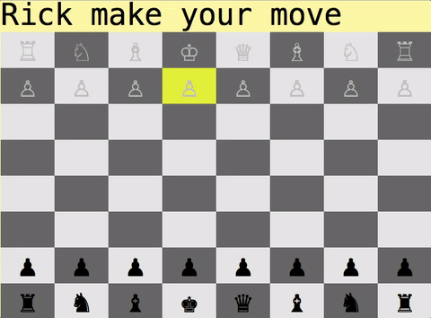

# Chess: The Game

## How To Play
0) These instructions assume you have Ruby installed.
1) Navigate to the folder containing these files in terminal
2) Enter 'bundle install'
3) Enter 'ruby game.rb'
4) Enter the player names as prompted.
5) Navigate with your arrow keys.
  i) First select a piece by navigating to it and hitting enter
  ii) Then select a destination by navigating to it and pressing enter


## Features
* Select Piece
  * Displays available moves
  * Does not display moves that result in check
* Announces check
* Announces checkmate
* Two Player
  * Can enter names at start.
* Cursor Input
* Castling

## Game View


## Code Highlights

### Gather valid moves through recursion

```
def check_for_valid_moves(current_pos, delta)
  pos = [current_pos[0] + delta[0], current_pos[1] + delta[1]]
  if board.in_bounds?(pos)
    on_board_valid_moves(pos, delta)
  else ## hit out of bounds
    return []
  end
end

def on_board_valid_moves(pos, delta)
  unless board[pos].class == NullPiece
    return board[pos].color == self.color ? [] : [pos]
  else ## hit a NullPiece
    return [pos] if self.is_a?(Knight) || self.is_a?(King)
    return [pos] + check_for_valid_moves(pos, delta) # Moves continuously in this direction
  end
end
```

By knowing the directional possibilities of a piece, we can determine all possible moves by recursively applying that directional change until collision with the end of the board or another piece.

### Determine background color


```
def square_color(pos)
  return BG_COLORS[:selected] if board[pos] == selected_piece
  return BG_COLORS[:cursor] if pos == cursor.cursor_pos
  unless selected_piece.nil?
    return BG_COLORS[:moves] if board.valid_moves(selected_piece).include?(pos)
  end
  default_colors(pos)
end

def default_colors(pos)
  row, col = pos
  if row % 2 == 0 && col % 2 == 0 ## if row and col are even => white
    return BG_COLORS[:white]
  elsif row % 2 > 0 && col % 2 > 0 ## if row is even, col is odd => white
    return BG_COLORS[:white]
  else
    return BG_COLORS[:black]
  end
end
```


With a few simple comparisons we can determine the background color of a space on the board.
